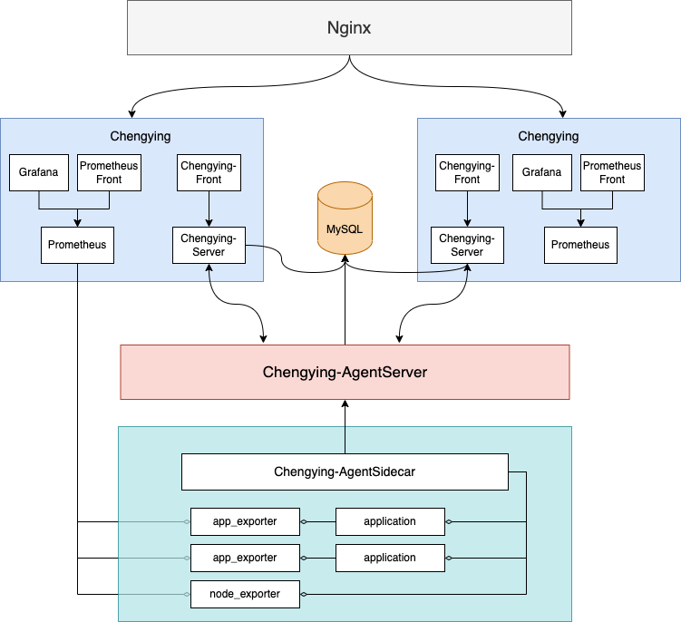

#Chengying
***

Chengying名字由来为中国古代十大名剑之一-承影。

Chengying来源于数栈运维管家-EasyManager，是袋鼠云数栈运维保障团队出品的一款支持标准化schema定义、自动化部署产品包的软件，旨在对产品包下每个服务进行部署、升级、卸载、配置等操作，解放人工运维成本。

##功能特征
***
###统一的产品包schema定义
* 抽象化产品包定义，用一套标准的schema定义一个产品包的完整的生命周期，包括安装、启动、配置、升级、卸载等。

###集群管理
* 支持多集群设置，便于在一套Chengying系统中部署多套资源隔离的服务；
* 支持对集群中所有产品包、所有主机、集群资源的管理。

###安装部署
* 支持产品包的快速安装与部署。

###服务管理
* 支持查看各服务及服务实例的运行状态、健康检查状态；
* 支持服务的配置修改下发；
* 支持服务的滚动重启；
* 支持服务的配置查看。

###监控告警
* 集成prometheus/grafana组件作为可视化仪表盘组件监控集群、主机、服务性能检测；
* 支持邮件、短信、钉钉以及自定义告警通道发送告警信息。

### 产品包升级/回滚
* 支持产品包、增量包、服务参数修改后的产品升级部署及版本回滚。

### 节点扩容/缩容
* 支持根据集群运行状况，产品化支持主机资源扩充与缩减。

##整体架构

##Contributing
Refer to the Contributing

##Lincence
Chengying is under the Apache 2.0 license. See the LINCENCE file for details.

